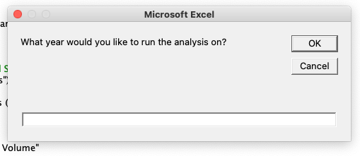
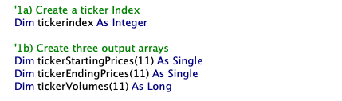
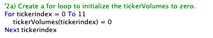
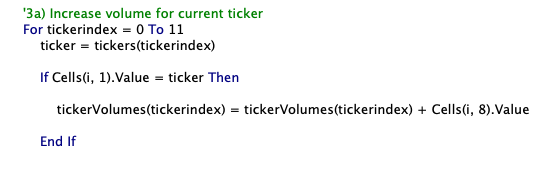
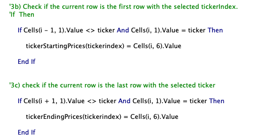
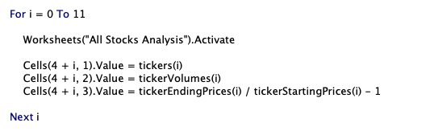
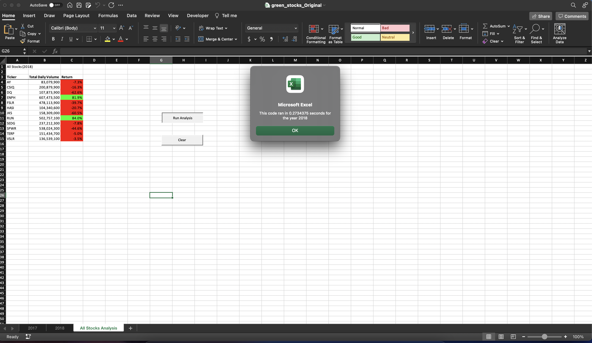

# Refactor-VBA-Code-and-Measure-Performance

## Overview of Project

Refactoring is a key part of the coding process. When refactoring code, we want to make the code more efficient—by taking fewer steps, using less memory, or improving the logic of the code to make it easier for future users to read.

In this analysis, we will refactor the VBA solution code in module 2 for the green stocks dataset to loop through all the data one time to collect the same information as the original code. Next, the efficiency of this refactoring code will be analysis by measuring the running time of the code. A successful refactoring code will made the VBA script run faster. Finally, we will discuss the advantage and disadvantage of the original and refactored VBA script.

## Results

In the beginning of analysis, a input box is used to select the year we want to run the solution code on.

#Input box to select the year

In order to loop through all the stocks one time, a ticker index is created as a variable. Also, three output arrays are created for ticker staring prices, ticker ending prices, and tocker volume.

#Code to create ticker index and output arrays

The initial ticker volume is setupt to zero with a for loop.

#Code to initialize ticker volume

The current volume for each ticker is increased by using the "tickerindex" variable as the index. The ticker starting prices and ending prices are assigned with the similar method as the original code. 

#Code to increase ticker volume

#Code to assign ticker starting prices and ending prices

Next, The "ticker", "total volume", and "return" are outputted in worksheets "All Stocks Analysis" by a for loop throught the output arrays we created earlier. 

#Code to output results

Next part of the code is about the formatting, which keeps the same as the original solution code.

Below is the table of results for year 2017 and 2018. The stock performance is much better in year 2017 with only one negative return. There are only two positive stock returns in 2018. 

.png)
#Results table for all stocks (2017)

.png)
#Results table for all stocks (2018)

The running time of this code is measrued by subtracting two varibles, "startTime" and "endTime". Then, a message box is used to display the running time for each year. 

The execution for the refactored script and original script is demonstrated as below:

#Execution times of the refactored script

#Execution times of the original script

The execution time of regactored script is about 0.25 seconds for both years while the execution time of original script both years is about 0.273 seconds. Thus, the regactored script is morev efficient than the original one, which means the refactoring is successful.

