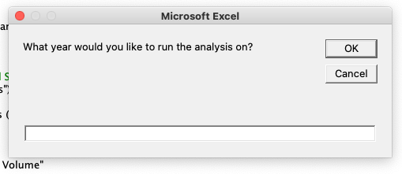
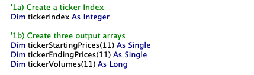
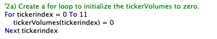
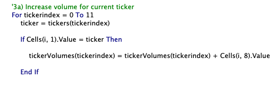
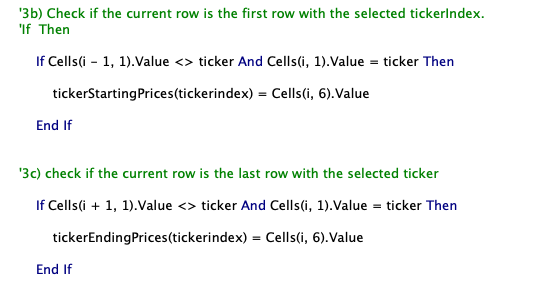
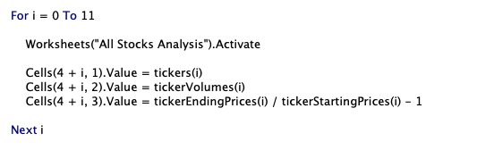
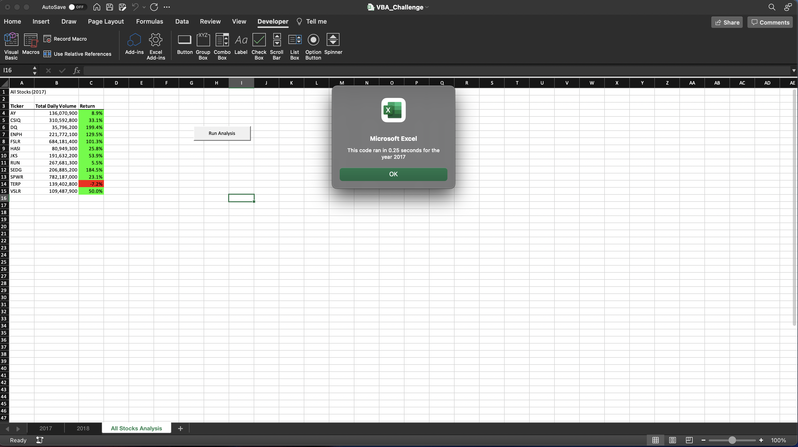
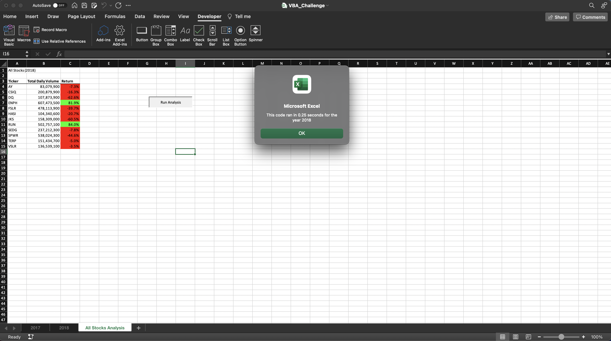
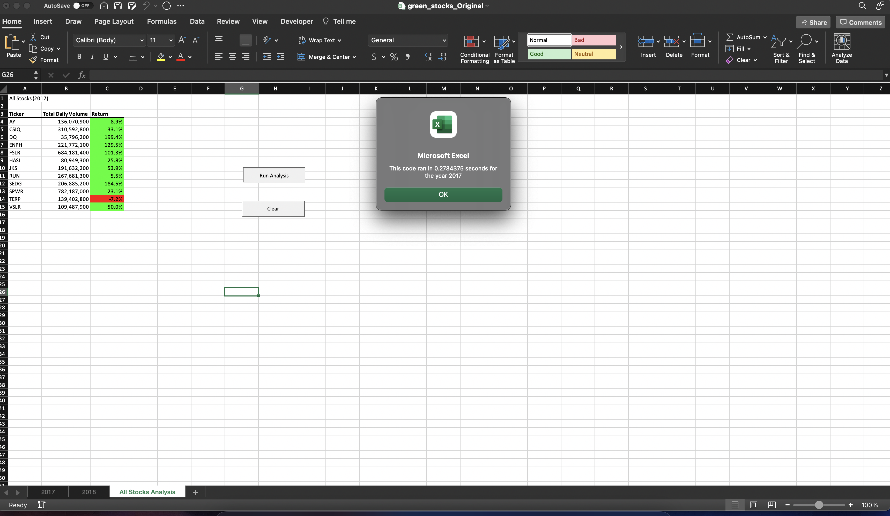
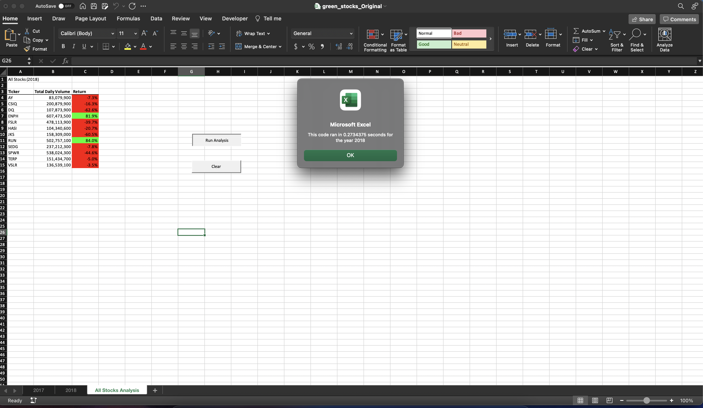

# Refactor VBA Code and Measure Performance

## Overview of Project

Refactoring is a key part of the coding process. When refactoring code, we want to make the code more efficient—by taking fewer steps, using less memory, or improving the logic of the code to make it easier for future users to read.

In this analysis, we will refactor the VBA solution code in module 2 for the green stocks dataset to loop through all the data one time to collect the same information as the original code. Next, the efficiency of this refactored code will be analysis by measuring the running time of the code. A successful refactored code will made the VBA script run faster. Finally, we will discuss the advantage and disadvantage of the original and refactored VBA script.

## Analysis and Results

### Analysis

In the beginning of analysis, a input box is used to select the year we want to run the solution code on:

In order to loop through all the stocks one time, a ticker index is created as a variable. Also, three output arrays are created for ticker staring prices, ticker ending prices, and tocker volume.

The initial ticker volume is setupt to zero with a for loop:

The current volume for each ticker is increased by using the "tickerindex" variable as the index:

The ticker starting prices and ending prices are assigned with the similar method as the original code:

Next, The "ticker", "total volume", and "return" are outputted in worksheets "All Stocks Analysis" by a for loop throught the output arrays we created earlier:

last part of the code is about the formatting, which keeps the same as the original solution code.

### Results

Below is the table of results for year 2017 and 2018. The stock performance is much better in year 2017 with only one negative return. There are only two positive stock returns in 2018. 

.png)

.png)

The running time of this code is measrued by subtracting two varibles, "startTime" and "endTime". Then, a message box is used to display the running time for each year. The execution time for the refactored script and original script is demonstrated as below.

Refactored Script:

Original Script:

The execution time of regactored script is about 0.25 seconds for both years while the execution time of original script both years is about 0.273 seconds. Thus, the regactored script is morev efficient than the original one, which means the refactoring is successful.

## Summary

### Gereral Advantages and Disadvantages of the Refactoring Code

Code Refactoring is a wise method of extending the code and making it more capable and in the same way it has some disadvantages. Before we start, we need to consider whether it is necessary to go for refactoring or not.

#### Advantages

Code Refactoring makes the code more extensible for adding many other function to it. It also helps in increasing the flexibility of the code and by this the capability of code increases. After refactoring, the code is fresher, easier to understand or read, less complex and easier to maintain.

#### Disadvantages

We may have no idea how much time it may take to complete the refactoring. In case if it went wrong, we will have to waste much more time in solving the problem and there are probable chances that it may go wrong due to complexity of the code. Sometimes, the cost of refactoring is higher than rewriting the code.

### Advantages and Disadvantages of the Original and Refactored VBA script

In this study, we analyzed the stock performance using the original and refactored VBA script. The results of stock performance are the same for both scripts. The efficiency of script is determined by comparing the execution time of both scripts. 

#### Advantages

The refactored code is more efficient because the running time of refactored code is less than original codes. It only loop through all the data one time to collect the same information as the original code.

#### Disadvantages

Comparing with original code, the refactored code has more for loops and more arrays, which makes it more complex. This could increase the chance of bugs, and also increase the time for maintenance in the future.  Moreover, althourgh the refactored code runs faster than the original code, the difference between their excution time is less than 0.1 seconds. This tiny difference is not efficient enought comparing with the time cost of refactoring this script.

